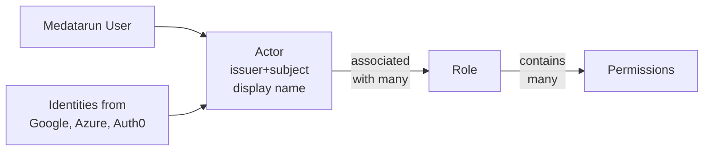
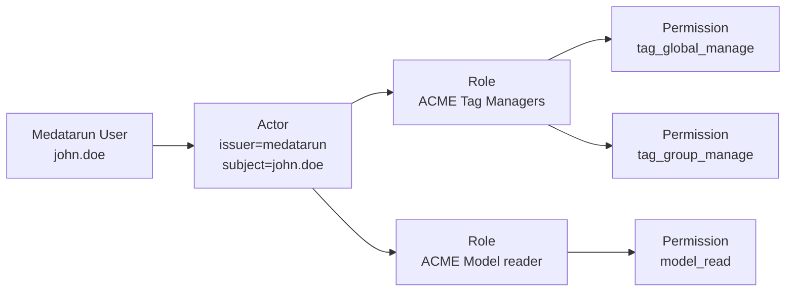
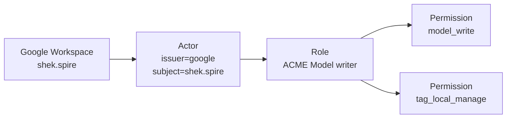
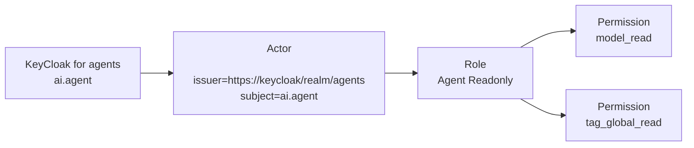

# Identity, actors, permissions

First, let's explain how Medatarun manages identities; it may look unusual if
you come from traditional software.

Medatarun has its own database of users, you may use it or not.
Identities can also come from your identity provider (Google, Microsoft EntraId,
Auth0, Keycloack, ...)

Medatarun treats all of those in the same concept of _Actor_.

Think of _Actor_ as a modern name for good old Users except they can come
from any identity provider you configured (OIDC or other JWT issuers),
Medatarun itself being one of them.

Actors can identity humans or service accounts or tools or agents.

That's why we cannot call them _users_ anymore.

An actor keeps information about

- where it comes from (the _issuer_),
- what is its identifier in the original identity system (the _subject_)
- how it is named (the _display name_).

To uniquely identify an actor, Medatarun give them unique identifiers
(ids, in UUID v7 format, for CLI and API operations mostly). 

Also, an actor is always unique by it _issuer_ and _subject_.

Those actors come from:

- Medatarun users, when you create users, they are synced to actors
- external providers, when we see a signed JWT token that matches your
  configured JWT issuers, we create or sync the corresponding actor
  automatically.

In the user-interface (or APIs or CLI) you will be able to see all actors,
coming from everywhere, set them permissions, revoke them if needed.

From Medatarun’s point of view, there is no functional difference between
an internal or external actor once it exists.

Later, when you look at the history of changes in your data or the list
of last executed actions, you will see exactly who did what.

## How we manage permissions

Permissions on Medatarun are fine-grained authorizations to do something.
For example `tag_global_manage` allow to create, update, delete global tags.

Roles are named bags of permissions. Medatarun creates managed roles such as
`reader`, `manager` and `admin` so you can assign common access levels
immediately.

You can also create your own roles with the permissions, name and description
you choose.

Finally you can affect one or more roles to **actors** (not users, actors) so
you can control who can do what in Medatarun, whether the person or the tool
comes from your Microsoft Azure Active Directory (EntraId), Google,
Keycloak or Medatarun itself.

## Examples of what you can do

In company _ACME_, user with login `john.doe` created in Medatarun can manage
tags but only read
models.

In company _ACME_, user `shek.spire` from Google Workspace can edit models and
only local tags.

In company _ACME_, the chat agent `ai.agent` from your Keycloak Realm `agents`
can read models and tags only.

