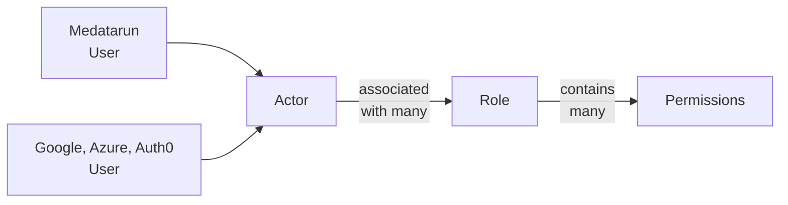

# Manage actors and permissions

[Actor](./actors.md) commands apply to all identities known to Medatarun,
whether they come from local users or external identity providers.

The user-interface has all the necessary screen to manage this.

Using the CLI or API you can run the following actions
assuming you are identified with an administrator role (
see [how to manage admins here](./manage-users.md)).

## List actors

`medatarun auth actor_list`

List all known actors: all actors maintained by Medatarun and also all external
actor that have connected at least once. Only available for admins.

This list gives you actor ids needed for further operations.

## Disable or enable an actor

`medatarun auth actor_disable --actorId=xxx`

Marks this actor disabled, meaning it won't be available to access Medatarun
anymore.
Has no effect on already disabled actors.

Note that its account is not removed, just marked as `disabled`. You can
re-enable it later if needed.

`medatarun auth actor_enable --actorId=xxx`

Marks this actor enable. Has no effect on already enabled actors.

## Roles and permissions

Medatarun ships with many permissions. For example, `tag_global_manage` lets actors create, update and delete global tags.

Roles are named sets of permissions. You assign roles to actors (not directly to
users), so the same model works for local users, external identity providers,
service accounts and tools. If needed, you can assign many roles to an actor.

You can manage roles and actor assignments from the user interface, the CLI or
the API.

Besides the roles you create yourself, Medatarun provides managed roles.
You can assign them to actors directly, but you do not edit their permissions,
name or description.

This helps you start without scratching your head:

- `reader`: can read models and tags, but cannot change them,
- `manager`: can read and write models, and manage global tags,
- `admin`: has administrator permissions.

Common CLI/API commands:

| Need | Command |
| --- | --- |
| List permissions | `medatarun config inspect_permissions` |
| List roles | `medatarun auth role_list` |
| Create a role | `medatarun auth role_create` |
| Add a permission to a role | `medatarun auth role_add_permission` |
| Assign a role to an actor | `medatarun auth actor_add_role` |

## Relationship to users

User commands as seen in [Manage users](./manage-users.md) affect local users as
well as their actor counterparts
in the same way.

Actor commands affect authorization and access for all identities, local users
and external users.
