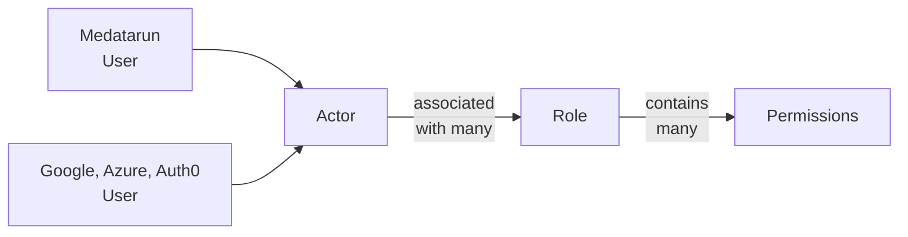

# Manage actors and permissions

[Actor](./actors.md) commands apply to all identities known to Medatarun,
whether they come from local users or external identity providers.

The user-interface has all the necessary screen to manage this.

Using the CLI or API you can run the following actions
assuming you are identified with an administrator role (
see [how to manage admins here](./manage-users.md)).

## List actors

`medatarun auth actor_list`

List all known actors: all actors maintained by Medatarun and also all external
actor that have connected at least once. Only available for admins.

This list gives you actor ids needed for further operations.

## Disable or enable an actor

`medatarun auth actor_disable --actorId=xxx`

Marks this actor disabled, meaning it won't be available to access Medatarun
anymore.
Has no effect on already disabled actors.

Note that its account is not removed, just marked as `disabled`. You can
re-enable it later if needed.

`medatarun auth actor_enable --actorId=xxx`

Marks this actor enable. Has no effect on already enabled actors.

## Roles and permissions

Medatarun ships with permissions, for example `tag_global_manage` allow actors
to create, delete, update global tags. To get a list of available permissions
run `medatarun config inspect_permissions`.

You can then create roles using `medatarun auth role_create` and add permissions
inside this role using `medatarun auth role_add_permission`.

Once done, you affect roles to actors (not users, actors). An actor can have
multiple roles. Use `medatarun auth actor_add_role` specifying the `key:xxx`
or the `id:xxx` of the role to add.

## Relationship to users

User commands as seen in [Manage users](./manage-users.md) affect local users as
well as their actor counterpart
in the same way.

Actor commands affect authorization and access for all identities, local users
and external users.

