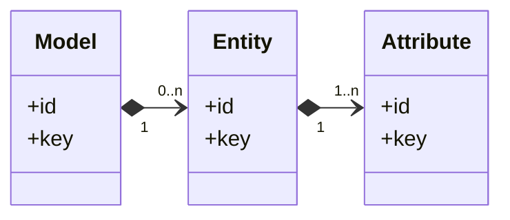

# Addressing objects in Medatarun

Like many other apps, in Medatarun we have to make a choice, early. How do we address objects in APIs and the CLI? Do we use `id="xxx"`? or `key="xxx"`? or something in between?

In most systems, as in previous projects I worked on, we avoid answering this question explicitly. Sometimes we don't even realize it is a question. But each time we will later pay the price.

Medatarun chose `ref=""`. This is the story of _why_.

## The general problem

_Addressing objects must come from an API contract, not from an implementation detail_.

Every system allows users to reference objects **from a different channel than the one that created them**.

Addressing makes it possible, and it becomes part of the product contract the moment users reference objects in scripts, API calls, user bookmarks, emails, or Jira tickets.

There are two valid ways to do that.

- **A semantic address** (keys, paths) is what we want for automation when we already know the objects from other parts of the information system.
- **An opaque address** (ids) that we use for interactive discovery, when we don't know what data exists in the app. It is what we learn by listing (fetch, search) and clicking (with UI).

Neither approach is better than the other because both are valid usages.

The problem is to _force_ one usage first across all communication channels, then trying to patch the channels later to catch up real usage.

Why? Once the product is shipped and used, the addressing style hardens:

- Users copy/paste them into scripts
- software integrations are built on APIs, so they mirror them
- and contracts become difficult to change without breaking production workflows.

Then try explaining to everyone that they need to change their scripts and software built on your API because you changed addressing on your tool's next version: impossible.

That is why _addressing decisions are one-way doors_.

## Concrete example

I worked on an app with its API designed with `id`s. This app was holding `CustomerRecord`s, created in the app itself.

The app could be used as a standalone product or could be integrated to a banking/insurance ecosystem. When integrated, the CustomerRecord from our app had equivalents on the banking/insurance ecosystem, because their own system already knows one kind of `CustomerRecord`, even if they don't call it `CustomerRecord` but `Customer` or `PolicyHolder`.

So each `CustomerRecord` had

- a database id: typical in SQL, not exposed to APIs
- an external id: the one for APIs, externally visible, generated by the system 
- and a business key `custom_id`: a free-form identifier, that represents the CustomerRecord as a `PolicyHolder` or  `Customer`. Moreover this could be empty if the system was not integrated. We didn't want to force users to specify _business keys_ to all customers.

Once shipped, the bank told us: we have too much latency in the synchronization process with your system's API, because we know only our `custom_id` (created by their system), but we need to use your lookup APIs to convert our `custom_id` into your proper `id` before each action call. Inside action payloads we also need to convert like this other object references.

At the other end, one of the insurance users told that everything was created in our system, then the `custom_id` method didn't work for them.

We needed a mix, we patched APIs how we could, introducing a mix of keys and ids everywhere as well as conversion APIs.

## Other examples

Where business products get stuck, with concrete operational fallouts:

**Salesforce** uses an `id` in their APIs and have [this kind of problems and complaints](https://salesforce.stackexchange.com/questions/277794/how-to-add-salesforce-id-field-for-records-that-i-am-trying-to-update). They have introduced a first-class escape hatch: [upserting by an External ID field](https://developer.salesforce.com/docs/atlas.en-us.api_rest.meta/api_rest/dome_upsert.htm). This improves integration ergonomics, but it also illustrates what "too late" means.

**Jira**'s [REST API](https://developer.atlassian.com/server/jira/platform/rest/v10005/api-group-issue) accepts an `issueIdOrKey` in payloads. But neither issue key or id are at the hand of the user. Here, keys are less stable than `id`s, because they can change when the issues are moved from one project to another. A thing to consider is that issues are mostly created in Jira, so the point we try to address is less problematic.

**Zendesk** has `id` and `external_id` [on tickets and users](https://developer.zendesk.com/api-reference/ticketing/users/users/) ( customers are users in Zendesk). `external_id` is "A unique identifier from another system" and case-insensitive. This allows synchronization with CRM and other tools where customers are managed. Addressing is made by `id` and Zenddesk provides lookup tooling to search by `external_id` but this is not a first-class reference. Integrations with Zendesk end with having the lookup problem we described. `external_id` explicitly do not have to be required or unique. As a consequence, lookups by `external_id` can return multiple tickets or users. It is a predictable consequence of adding semantic identifiers after everything had been id-based.

**Stripe** uses a metadata approach. [Documentation](https://docs.stripe.com/api/metadata) says you can attach your system's unique IDs to a Stripe object to simplify lookups, using metadata. For example, add your order number to a charge, your user ID to a customer or recipient, or a unique receipt number to a transfer. But the API can't guess what metadata you used as external identifiers, so you end up [using search query language](https://docs.stripe.com/search#search-query-language) to get ids again.

These products are "already too late" because the public payloads and the ecosystem habits are formed. They can add secondary mechanisms, but they cannot rewrite the underlying contract without breaking integrations at scale.

## Medatarun requirements

Medatarun has those requirements:

- to be integrated to information systems and represent data meaning from other parts of the system. The choice had been made, from the beginning, that all objects (models, entities, attributes, ...) have a required `key`, unique within the object's scope, at the hand of the user.
- `key`s exist in a scope. For example, an attribute key is unique in an entity. An entity key is unique in a model. A model key is unique in your running instance.
- Addressing a deeply nested object requires its containing context, for example if your "crm" model has a "customer" entity with a "phone_number" attribute (those are keys), you need to address this attribute fully by specifying each key: a model key `crm`, then an entity key `customer`, then an attribute key `phone_number` in this example.

It is not very different from what you see in other integrated systems like Kubernetes or Terraform where things are described with human keys. But this time, we want to elevate `id` and `key` to the same level of usage. 

At this point, the question is no longer _whether_ ids or keys are better: 

> In Medatarun we do not want one to be secondary to the other. 
> We do not want to lock everything into one of them.

## Another way: references

We choose this core principle: use `key` when you already know, use `id`s when you discover.

Medatarun needs both because opposite knowledge states exist:

- When a caller uses keys, it usually already knows the domain identity from the information system and wants deterministic scripting without pre-lookups.
- When a caller uses ids, it usually discovered objects inside Medatarun (typical for UI or exploratory workflows) and wanted direct pointers without reconstructing deep key paths.

The API architecture therefore treats "references" as a first-class concept
and standardizes it across the entire action surface.

## Medatarun addressing design: "ref"

### Top level objects

The Medatarun design: **Ref everywhere, encoded as URI-like strings.**

Every action payload references objects through typed refs: `ModelRef`, `TypeRef`, `EntityRef`, `RelationshipRef`, `AttributeRef`, etc. Actions never expose parallel fields like `id` versus `key`. They accept `ref` only.

In JSON, refs materialize as **URI-like** strings with an explicit scheme that acts
as the discriminant.

For ModelRef, for example, the canonical forms are:

- `id:xxx` where xxx is the UUID v7 of the referenced object.
- `key:xxx` where xxx is your key.

The scheme is the **discriminant** (`id:` vs `key:`). There is no guessing.

Ids and keys are both public-level identifiers for API/CLI/UI usage.

As an example:

```bash
medatarun model model_update_name --modelRef="id:xxxx" --name="New name"
# or 
medatarun model model_update_name --modelRef="key:model" --name="New name"
# or 
curl -X POST https://yourmedatarun/api/actions/model/model_update_name \
    -H "Content-Type: application/json" \
    -d '{
      "modelRef":"id:xxx",
      "name":"New name"
    }'
# or 
curl -X POST https://yourmedatarun/api/actions/model/model_update_name \
    -H "Content-Type: application/json" \
    -d '{
      "modelRef":"key:xxx",
      "name":"New name"
    }'
```

Please note that the internal storage identifier is a separate topic and is not part of this contract. The `id` you see everywhere is the publicly exposed id only. 

### Nested objects

In Medatarun, we have nested objects, meaning objects that cannot exist in the top-level scope. For example, attributes cannot exist outside entities, entities cannot exist outside models. A Model is a top-level object. 



Addressing by `key` requires that you provide a full path to the attribute (for example, model="crm" and entity="customer" and attribute="phoneNumber"). At first, we thought to include everything in a single reference (`key:model=xxx&entity=xxx&attribute=xxx`). This idea was explicitly rejected. It would have made references context-dependent, harder to compose and made scripts like the one at the end of this doc impossible (or too complex). Medatarun therefore **forbids** composite hierarchical refs.

Addressing by `id`, and because they are UUIDs, we could be tempted to say that an id alone is always enough. But experience tells that it is not the case. Doing that would introduce a conceptual ambiguity. Moreover, it makes an assumption on how ids are produced.

So we chose this rule:

> If an object can exist on its own, it can be addressed on its own.
> If not, addressing it must include its parent contexts.

So addressing an attribute means specifying modelRef, attributeRef, entityRef.

Example

```bash
medatarun model entity_attribute_update_description \
  --modelRef="key:crm" \
  --entityRef="key:customer" \ 
  --attributeRef="key:phone_number" \ 
  --value="New description"
# or with API
curl -X POST https://yourmedatarun/api/actions/model/entity_attribute_update_description \
    -H "Content-Type: application/json" \
    -d '{
      "modelRef":"key:crm",
      "entityRef":"key:customer"
      "attributeRef":"key:phone_number"
      "value":"New description"
    }'
```

Note how you can now mix addressing by `id` and by `key`.

## Consequence: simplify control

When you write a script on id-based APIs you mix two kinds of logic: business intent and lookup logic. Before doing anything, you must resolve keys into ids, often through additional API calls. You often end up keeping maps from _id to key_ or _key to id_ to make conversions. Addressing is no longer _data_ anymore, it is part of the execution flow. Change addressing, and you change the code.

By using a reference, addressing is carried by the data (the reference) not by the code.
This is especially useful when you write your scripts. Imagine you need to compare a canonical model to a freshly imported model (from your own databases).

```javascript
const API = "https://yourmedatarun/api/actions";

async function action(group, name, payload) {
    return fetch(`${API}/${group}/${name}`, {
        method: "POST",
        headers: {"Content-Type": "application/json"},
        body: JSON.stringify(payload)
    }).then(r => r.json());
}

const canonicalModelRef = "key:crm"

// export the canonical model
const base = await action("model", "model_export", {
    modelRef: canonicalModelRef
});

// delete old imports, we know they all have a key starting with "crm_testenv"  
const models = await action("model", "model_list")
    .filter(it => it.key.startsWith("crm_testenv"))
    .forEach(async it => await action("model", "model_delete", {modelRef: `id:${it.id}`}))

// import from datasource, we don't set a key, we don't know the final key 
// Imports are configured to create a key starting with "crm_testenv"
// (it is an example)
await action("model", "import", {
    from: "datasource:crm_testenv",
});

const importedModelSummary = await action("model", "model_list")
    .find(it => it.key.startsWith("crm_testenv"))

// remove unwanted entities from imports
// 💡 look at how we can mix ids and keys 
await action("model", "entity_delete", {
    modelRef: `id:${importedModelSummary.id}`,
    entityRef: `key:DATABASECHANGELOG`
});

// export modified model
const updated = await action("model", "model_export", {
    modelRef: `id:${importedModelSummary.id}`
});

// diff entities
const added = updated.entities
    .filter(e => !base.entities.find(b => b.key === e.key))
    .map(e => e.key);

console.log("Added entities not documented:", added);
```

## How it is implemented

In Kotlin, each object's key and object id has its own type. This is to prevent primitive obsession. So you have `ModelId`, `ModelKey`, `EntityId`, `EntityKey`. 

- `XXXId` are value classes that contain a UUID: `value class ModelId(val value: UUID)`
- `XXXKey` are value classes that contain a String: `value class ModelKey(val value: String)`

This makes sure that in functions we don't swap a ModelId with an EntityId by mistake. We would get compile time errors if it happens. With Strings or UUID everywhere, you don't know what you carry. Great.

References are modeled as sealed types. For example: 

```kotlin
sealed interface ModelRef {
    data class ById(value: ModelId): ModelRef
    data class ByKey(value: ModelKey): ModelRef
}
```

This way we centralize at the entrance of the action pipeline parses and resolves the refs uniformly before business logic runs. Business code only sees `ModelRef` with the correct subtype immediately.

Then it's the business code goal to resolve that to real objects, but it's just a matter of centralizing this logic in business. For example, we already had `findById` and `findByKey`. 
Adding `findByRef` becomes simple: 

```kotlin
fun findByRef(ref:ModelRef) = when(ref) { 
    is ModelRef.ById -> findById(ref.value)
    is ModelRef.ByKey -> findByKey(ref.value)
}
```

## End words

I wanted to avoid a common API trap early. 

This approach won't fit every product and is not meant to be a universal solution. It exists because Medatarun is built from scratch, and that gave me rare opportunities:

- to design object addressing _before_ any usage, script, or integration makes it irreversible;
- improve an API usage from the start, reducing frictions and adoption for integrators, as myself (as a user) would have wished some APIs to be.

I have seen too many systems where `id` is the only way to address objects – sometimes even a database id – simply because it is the most obvious choice. Months later, those systems growing with their customer usages discover that they had no escape route. Once an API is id-centric or key-centric, everything grows around that, and the contract freezes.

With `ref`, and the explicit use of `id:` and `key:` schemes, I intentionally create an exit. Not because I expect to use it (hope not), but because a system without an exit cannot evolve safely. 

If one day we need to evolve, we can introduce a new scheme, deprecate others, without pretending the past ones don't exist.

Only time will tell how far this choice carries. But this time, at least, the door is not locked behind us.

These decisions are invisible at launch.
You only notice them years later — when they were not made.